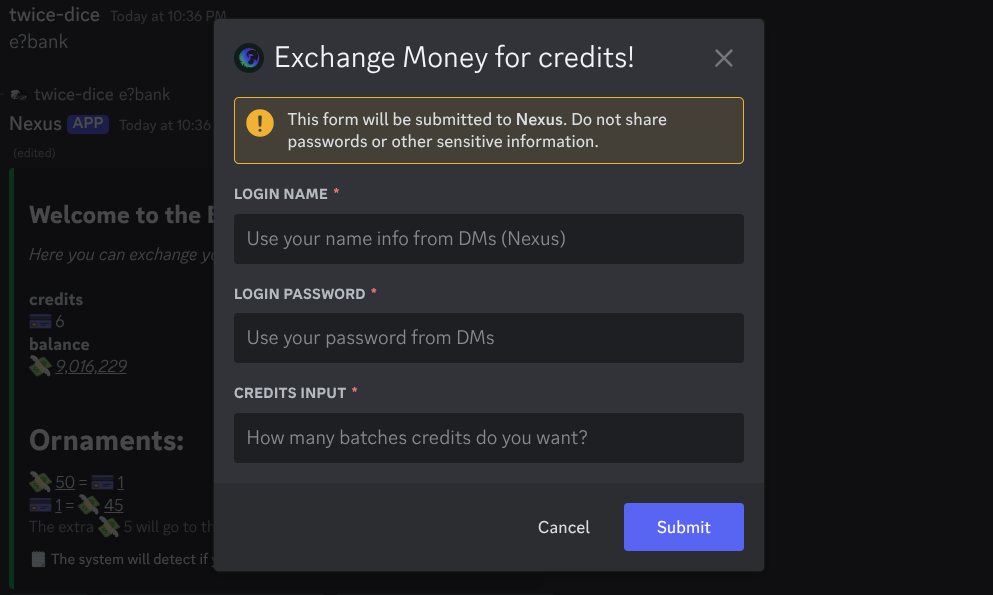

# How to receive credits?


**\[! Free Perk]** - If you are the owner of the server, you own more!


## Explanation & Steps:

Credits are none as a value of currency that can and may be used for anything!

***

## How to receive them?

They only way to receive credits is to exchange your money for them.

***


You will have to input your corresponding bank account credentials. (The one you just created.)&#x20;


<figure><figcaption></figcaption></figure>

***

## Further Explanation...

<figure><figcaption></figcaption></figure>

To exchange for credits, they usually cost $50 for a each credit, and 5 extra credits will go to the owner of the server. If you want to reverse your trade, you will receive $45 for each credit you return, $5 extra will also go to the server owner as well.
